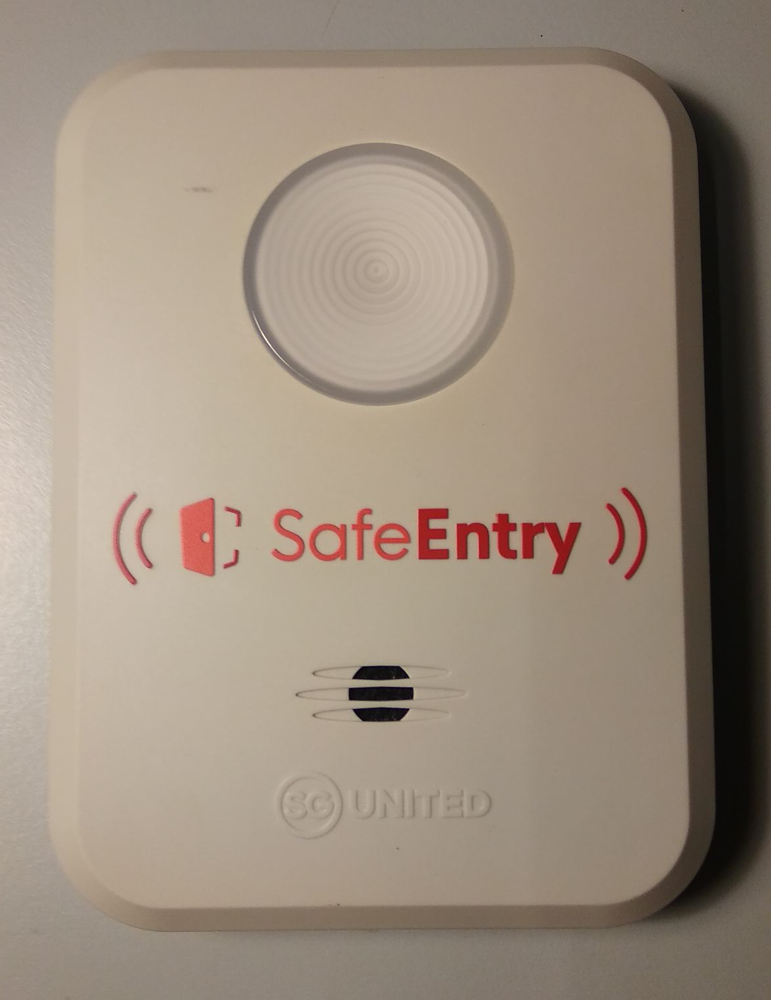
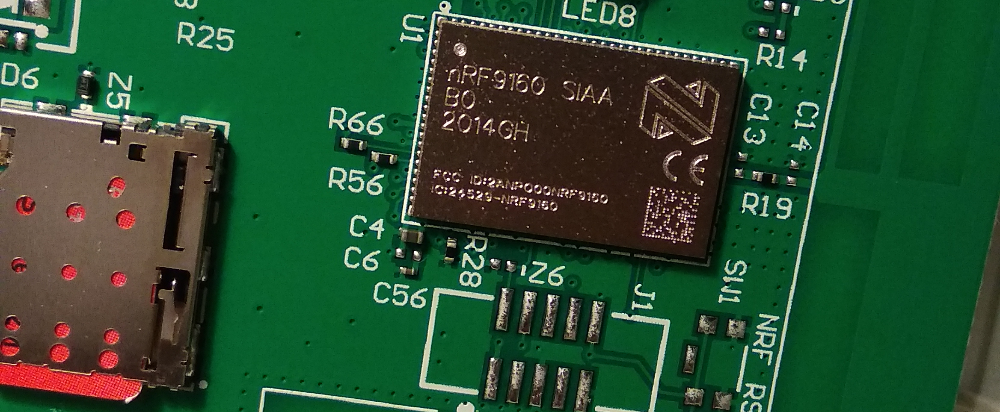

# SafeEntry Gateway

This is a disassembly of the SafeEntry Gateway (Version D). Unfortunately no schematic recreation is available at this time.

## Main Hardware Components
| Reference: 	| Description:                                     	|
|------------	|--------------------------------------------------	|
| U1         	| nRF9160 4G IoT cellular SiP (System in Package)  	|
| U5         	| GD25WQ64E 64Mbits Serial NOR Flash memory        	|
| U6         	| ST Microelectronics STM32WB55CG MCU with BLE 5.4 	|

## Hardware Pictures

-  Gateway Front

-  Gateway Back

-  Front of board

-  Back of board

-  Microcontroller

-  4G Modem System in Package (SiP)

