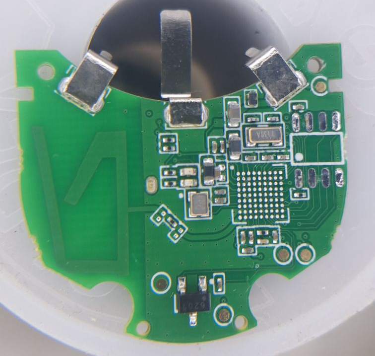
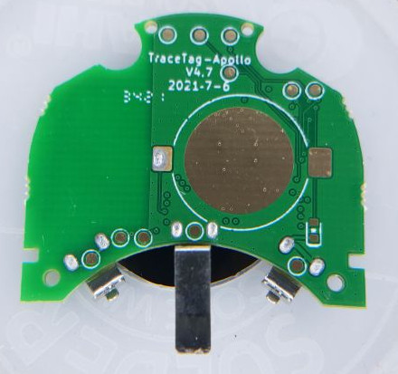

# TraceTag-Apollo V4.7

This is a disassembly and electronic reverse engineering of the TraceTag-Apollo V4.7. Schematic recreation is pending.

## Main Hardware Components
| Part               	| Description:                              	|
|--------------------	|-------------------------------------------	|
| MCU                	| Ambiq Apollo 3 AMA3B1KK-KBR Bluetooth SoC 	|
| Flash Memory       	| Puya P25Q64H 64Mbit Serial Flash          	|
| Hall Effect Sensor 	| CC6201                                    	|

## Hardware Pictures

-  Front of board

-  Front of board 

-  Front of board (with MCU desoldered to expose traces underneath)

-  Back of board
